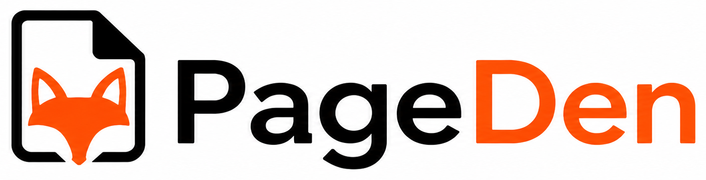

<p align="center">
  <picture>
    <source media="(prefers-color-scheme: dark)" srcset="assets/pageden-logo-dark.png" width="380">
    
  </picture>
</p>
<p align="center">
  <i>One source of truth for people and AI.<br/>
  A shared Markdown knowledge base your team can edit, sync from Obsidian, and connect to AI agents.</i>
</p>

<p align="center">
  <a href="https://github.com/ccfiel/pageden/actions/workflows/ci.yml"></a>
  <a href="http://www.typescriptlang.org"></a>
  
  
  
  
</p>

---

Pageden is a shared Markdown vault for teams and AI agents. The server owns the canonical
content, permissions, versions, audit log, search index, attachments, Obsidian sync metadata,
and MCP agent access.

## What Is Here

```text
apps/
  server/           Fastify + Prisma + PostgreSQL API
  web/              Vite + React + TanStack Router/Query + Tailwind
  obsidian-plugin/  Obsidian integration and sync/import tools
packages/
  api-types/        Shared zod schemas + inferred API types
  mcp/              Stdio MCP bridge for Codex, Claude, and other agent clients
  tsconfig/         Shared TypeScript base config
```

## Core Capabilities

- Web document editor with versioning, optimistic concurrency, attachments, search, and
  permission-aware document access.
- Obsidian plugin for remote browse/search, document download, background sync, live editing,
  and vault import.
- Web vault import with frontmatter preservation, duplicate handling, import reports, and
  attachment warnings.
- Workspace-bound AI agent keys and MCP tools for Codex, Claude, Hermes, OpenClaw, and other
  MCP-compatible clients.
- Agent-friendly document reads with frontmatter, headings, wikilinks, body extraction, and
  `aiReadiness` checks.

For nontechnical agent setup, see [AI_AGENTS.md](AI_AGENTS.md).

## Quick Start

Requires Node 20+, [pnpm](https://pnpm.io) 9, and Docker.

```bash
cp .env.example .env
pnpm install
pnpm db:generate
docker compose up -d postgres
pnpm db:migrate
pnpm db:seed
pnpm dev
```

- Web app: http://localhost:3000
- API: http://localhost:4000/api
- Health checks: `/api/health`, `/api/ready`

There is one root `.env`. The server scripts load it through `dotenv-cli`, so you do not need
an `apps/server/.env`.

## Local Test Database

Integration, contract, security, and coverage tests truncate every table between tests. Use a
throwaway database, never a development database with useful data.

```bash
cp .env.test.example .env.test
docker compose exec -T postgres psql -U pageden -d pageden -c "CREATE DATABASE pageden_test;"
pnpm --filter @pageden/server exec dotenv -e ../../.env.test -- prisma migrate deploy
```

## Common Commands

```bash
pnpm typecheck
pnpm lint
pnpm build
pnpm test
pnpm test:integration
pnpm --filter @pageden/server test:coverage
pnpm test:all
pnpm test:all --e2e
pnpm test:report
```

`pnpm test:all` starts Postgres with Docker, applies migrations, then runs unit,
integration, contract, security, and coverage tests. Use `--no-docker` when you already have a
test database running.

## Database And Storage

```bash
pnpm db:migrate:dev --name my_change
pnpm db:migrate
pnpm db:generate
pnpm db:seed
pnpm --filter @pageden/server storage:sweep
```

Run `pnpm db:generate` after changing `apps/server/prisma/schema.prisma`.

## Deployment

This public repository is for the open-source app and local/self-host development. For
self-hosting, build the app with the commands above and run it with your own PostgreSQL
database, object storage, reverse proxy, and TLS setup.

## Troubleshooting

- `Module '"@prisma/client"' has no exported member ...`: run `pnpm db:generate`, then restart
  your editor TypeScript server if needed.
- `Environment variable not found: DATABASE_URL`: use the provided `pnpm db:*` scripts, or
  prefix raw Prisma commands from `apps/server` with `dotenv -e ../../.env --`.
- Browser E2E failures after UI changes: run `pnpm --filter @pageden/web build` first, then
  rerun the Playwright suite.

## Contributing

Keep changes scoped, keep CI green, and add tests with behavior changes. Use Vitest for
server/unit/integration coverage and Playwright for browser-only workflows.

## License

Pageden is licensed under the [Business Source License 1.1](LICENSE) (BSL 1.1). You can read,
modify, and self-host it, including internal production use, but you may not offer it to third
parties as a competing hosted/managed service. Each released version converts to the
[Apache License 2.0](https://www.apache.org/licenses/LICENSE-2.0) on its Change Date, four
years after release. See [LICENSE](LICENSE) for the full terms.
